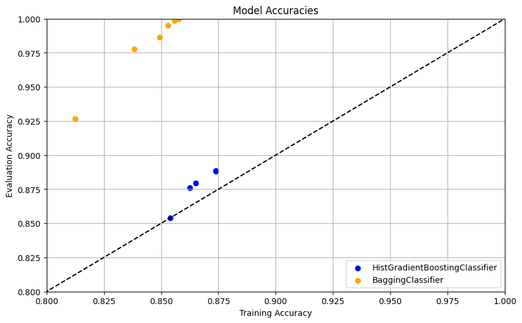

# CS 178 Final Report

## 1. Abstract
Income is a significant measure of a individual, thier  lifestyle, and their role in society. When individuals make goals regarding thier career or finances, understanding how individuals become sucessful or have a high income is importaint. Reporting demographics or US citizens against a certain annual income helps isolate features and feature combinations that result in financial sucess for individuals, can help police reported incomes, and gives a clearer picture into the lives of the nation, and how they change over time. In particular, this report will feature what makes an individual an above-average earner. Kaggle and the UCI ML Repo provide the Adult Income Dataset, a subset of Income data from the 1996 US Census, that provides a demographics against a classification of individual income. This classification regards if the income of an individual, in the 1995 fiscal year, was above $50,000 USD. Various models including Graient and Hisogram Boosed Tree models will be used for classification.

## 2. Data Exploration

The Adult Income dataset consists of 32,561 observations of 15 factors, including both categorical and numeric factors.

#### Numeric Factors

\begin{array}{|l|l|l|}
\hline
\textbf{Factor} & \textbf{Variance} & \textbf{Mean} \\
\hline
\text{age} & 186.056 & 38.5816 \\
\text{fnlwgt} & 1.11405 \times 10^{10} & 189778 \\
\text{education_num} & 6.61869 & 10.0807 \\
\text{capital_gain} & 5.45409 \times 10^{7} & 1077.65 \\
\text{capital_loss} & 1.62372 \times 10^{5} & 87.3038 \\
\text{hours_per_week} & 152.454 & 40.4375 \\
\hline
\end{array}

#### Categorical Factors
\begin{array}{|l|l|l|}
\hline
\textbf{Factor} & \textbf{Categories} & \textbf{Most Common} \\
\hline
\text{workclass} & 8 & \text{Private} \\
\text{education} & 16 & \text{HS-grad} \\
\text{marital_status} & 7 & \text{Married-civ-spouse} \\
\text{occupation} & 14 & \text{Prof-specialty} \\
\text{relationship} & 6 & \text{Husband} \\
\text{race} & 5 & \text{White} \\
\text{sex} & 2 & \text{Male} \\
\text{native_country} & 41 & \text{United-States} \\
\hline
\end{array}

#### Response Income
The annual income factor is binary, having value '<=50K' or '>50K'. This is converted into a boolean value, with '>50K' being 1, and '<=50K' as 0 (or -1). Income takes form '<=50K' just under a quarter of the time (p = 0.24081).

#### Factor Covariance and Entropy
F-values are used in analysis of variance (ANOVA) to assess the connection between or within variables and the response, quickly  helping to identify important predictors in the dataset. Additionally, the information gain of getting a value for each category defines how importaint each predictor is towards a final classification. 

\begin{array}{|l|l|l|}
\hline
\textbf{Feature} & \textbf{F-Score} & \textbf{Information Gain} \\
\hline
\text{education_num} & 4120.095780 & 0.093591 \\
\text{relationship} & 2187.645828 & 0.165366 \\
\text{age} & 1886.707314 & 0.099218 \\
\text{hours_per_week} & 1813.386282 & 0.061002 \\
\text{capital_gain} & 1709.150064 & 0.120295 \\
\text{sex} & 1593.107907 & 0.037171 \\
\text{marital_status} & 1346.851776 & 0.156528 \\
\text{capital_loss} & 754.830452 & 0.053352 \\
\text{education} & 206.129509 & 0.093591 \\
\text{race} & 168.934788 & 0.008378 \\
\text{workclass} & 99.237663 & 0.021572 \\
\text{native_country} & 17.464773 & 0.008695 \\
\text{occupation} & 3.799514 & 0.092922 \\
\text{fnlwgt} & 2.915594 & 0.568010 \\
\hline
\end{array}

## 3. Data Preprocessing
The provided data contains NAs in the form of ?. These are handled at the modelling level using NA ommission. For initial modelling, we find no significant fraction of any collumns contain empty values. No significant outlier exists in entries, indicating misinput or otherwise. The dataset contains both categorical and numeric values. Categorical data is non-ordinal, but in some modelling, ex extracted into binary factors. The response, income, had no missing values

Training and evaluation data is split at a ratio of 20% evaluation data (N = 26048), 80% training (N = 6513).

## 4. Model Selection and Training
For this project, the most effective classifiers were tree-form classifiers that were comfortable working with large datasets. Initially, a tuned random forest classifier having an 85.72% evaluation accuracy, however with a very high overfitting. Random forest training accuracy converged to over 99%. To combat this overfitting, two appoaches were isolated.

### Approach diffirences
Ensamble approaches provide a way to combat model overfitting, and allow for convergence to higher evaluation scores. 
For large N values ( N > 10K), HistGradientBoostingClassifier operates by operating on a subset of the factors to create large voting. HistGradientBoostingClassifier performs significantly better on training data compared to the regular GradientBoostingClassifier without overfitting, evident in its higher evaluation accuracy compared to the regular GradientBoostingClassifier's training accuracy. 
The Extra Trees classifier is another ensamble, operating as a voting ensamble with trees training on subsets of the dataset. 

## 5. Model Evaluation
- **Performance Metrics**: Metrics used to evaluate model performance (e.g., accuracy, precision, recall, F1 score).
- **Comparison of Models**: Comparative analysis of different models and their performance.

Models are evaluated based upon accuracy, with the primary metric of significance being the model classification accuracy. Using a field of tweaked hyperparameters, model evaluation accuracy and training accuracy can be calculated.

This comparison shows that while the Hist Bagging approach has marginally higher evaluation accuracy, it  has significantly less overfitting, seen as a smaller distance from the dividing dotted line.

In comparing these two models, there is an observable diffirence between the types of ensambles to combat overfitting when creating ensambles from subsets of the factors for this dataset. This likely means that there is a natural and generalizable trend between factors and response. This is corraberated with high accuracy when applyting Logistic Regression, and from the high accuracy achivable by these factor-based models.

## 6. Model Optimization
- **Addressing Underfitting/Overfitting**: Strategies used to handle underfitting and overfitting.
- **Feature Design**: Impact of feature design on model performance.
- **Special Data Handling**: Techniques used to handle special aspects of the data (e.g., missing features, large numbers of zeros).

## 7. Final Model and Results
- **Chosen Model**: Description of the final model selected.
- **Final Performance**: Performance of the final model on the test set.
- **Insights and Interpretations**: Key insights and interpretations from the final model's performance.

## 8. Conclusion
- **Summary**: Summary of the project and key findings.
- **Future Work**: Potential future work and improvements.

## 9. References
- **Citations**: List of references and resources used in the report.
